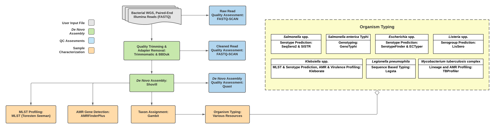

===========
TheiaProk
===========

The TheiaProk workflows are for assembly and characterization of prokaryotic genomes, principally bacteria. All input reads go through steps for read trimming and assembly, quality assessment, species identification and resistance gene identification. Sub-workflows further characterize some genomes, with activation of these processes dependent on the taxa identified. 

Currently, there is one TheiaProk workflow. This is for reads generated with Illumina paired-end sequencing. Further workflows taking in alternative sequence data types may be developed.

**TheiaProk_Illumina_PE**
===========================

**Inputs:** TheiaProk_Illumina_PE takes in Illumina paired-end reads with an average genome depth of coverage of [x] X. By default, the workflow anticipates **2 x 150bp** reads. For other read lengths, modification of the default trimming parameters is recommended. For more details about TheiaProk_Illumina_PE input files, see the tables of `required inputs <https://github.com/theiagen/public_health_bacterial_genomics/blob/main/docs/source/tables/theiaprok_illumina_pe_required_inputs.csv>`_` and `optional inputs <https://github.com/theiagen/public_health_bacterial_genomics/blob/main/docs/source/tables/theiaprok_illumina_pe_optional_inputs.csv>`_.

**Core-workflow**

Quality trimming and adapter removal: Trimmomatic, BBDuk

De Novo assembly: Shovill

QC: FASTQ-SCAN (reads before and after trimming); Quast (assemblies)

Core sample characterization: Abricate (which db?); AMRFinderplus for ARG detection; Gambit for taxa identification; MLST (available MLST schemes) 

**Taxa-specific subworkflows**

**Mycobacterium tuberculosis**
* TB-profiler

**Salmonella spp**
* SeqSero2
* SISTR

**Escherichia spp**
* SeroTypeFinder
* ECTyper

**Listeria spp**
* LisSero

**Klebsiella spp**
* Kleborate

**Outputs:** The workflow produces trimmed reads, assembly files, QC metrics and genome characteristics, depending on taxa analyzed. For more details about TheiaProk output files, please see [theiaprok_illumina_pe_outputs.csv].

.. toggle-header::
    :header: **References**

        When publishing work using TheiaProk_Illumina_PE, please reference the following:

        **trimmomatic** Bolger AM, Lohse M, Usadel B. Trimmomatic: a flexible trimmer for Illumina sequence data. Bioinformatics. 2014 Aug 1;30(15):2114-20.

        **BBDuk** Bushnell B. BBTools software package. URL http://sourceforge. net/projects/bbmap. 2014;578:579.

        **fastq-scan** Petit RA, III. 2020. fastq-scan. Output FASTQ summary statistics in JSON format. https://github.com/rpetit3/fastq-scan.

      